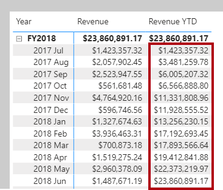

# Use DAX time intelligence functions

DAX မှာ Time Intelligence Functions တွေဟာ Date Table နဲ့ ဆက်စပ်ပြီး အလုပ်လုပ်ပါတယ်။ ဒီ Functions တွေက ရက်စွဲ Column တွေကို Input အနေနဲ့ယူပြီး Filter Context ကို ပြောင်းလဲပေးခြင်းဖြင့် လိုချင်တဲ့ အချိန်အလိုက် တွက်ချက်မှုတွေကို လုပ်ဆောင်ပေးပါတယ်။

အဓိက Time Intelligence Functions အမျိုးအစား ၃ မျိုးကို အောက်မှာ ဖော်ပြထားပါတယ်

* Period-to-date Functions (ကာလတစ်ခုမှ လက်ရှိရက်စွဲအထိ data ကို analysis လုပ်တာ)
* Comparison Functions (ကာလနှစ်ခု နှိုင်းယှဉ်ခြင်းပြီး analysis လုပ်တာ)
* Date Range Functions (ကာလတစ်ခုအတွင်းက data ကို analysis လုပ်တာ)

#### Period-to-Date Functions

ဒီ Functions တွေဟာ နှစ်အစကနေ (သို့မဟုတ် လအစကနေ၊ Quarter အစကနေ) လက်ရှိရက်စွဲအထိ ဒေတာတွေကို စုပေါင်းတွက်ချက်ပေးပါတယ်။ လုပ်ငန်းခွင်မှာ "Year-to-Date (YTD)" လိုမျိုး စုစုပေါင်းတွေကို တွက်ရာမှာ အသုံးဝင်ပါတယ်။

<figure><figcaption></figcaption></figure>

* TOTALYTD : တစ်နှစ်ရဲ့အစကနေ လက်ရှိ Filter Context ထဲက နောက်ဆုံးရက်စွဲအထိ စုစုပေါင်းတန်ဖိုးကို တွက်ပေးပါတယ်။


```dax
TOTALYTD(<expression>, <dates>[, <filter>][, <year_end_date>])
```


* **`<expression>`** : စုပေါင်းလိုတဲ့ Measure သို့မဟုတ် Expression (ဥပမာ- SUM(Sales\[Amount]))&#x20;
* `<date>` : Date Table ထဲက Date Column ကို ရည်ညွှန်းရပါမယ်။ (ဥပမာ- 'Date'\[Date])&#x20;
* `<year_end_date>` _<mark style="color:red;">(Optional)</mark>_: ဘဏ္ဍာရေးနှစ်ရဲ့ နောက်ဆုံးရက်ကို သတ်မှတ်နိုင်ပါတယ်။ မသတ်မှတ်ရင် ဒီဇင်ဘာ ၃၁ ရက်ကို ယူပါတယ်။

<pre class="language-dax" data-title="e.g" data-overflow="wrap"><code class="lang-dax">Sales YTD = TOTALYTD(SUM(Sales[Sales Amount]), 'Date'[Date])

<strong>//ဒီ Measure က လက်ရှိ Filter Context (ဥပမာ- Chart မှာ 2024 ခုနှစ်ကို ရွေးထားရင်) 2024 ဇန်နဝါရီ ၁ ရက်ကနေ လက်ရှိ Chart ရဲ့ နောက်ဆုံးရက်စွဲအထိ Sales Amount တွေကို ပေါင်းပေးပါလိမ့်မယ်။TOTALMTD (Month-to-Date / လအစမှ ယနေ့အထိ)
</strong></code></pre>

* TOTALMTD : တစ်လရဲ့အစကနေ လက်ရှိ Filter Context ထဲက နောက်ဆုံးရက်စွဲအထိ စုစုပေါင်းတန်ဖိုးကို တွက်ပေးပါတယ်။


```dax
TOTALMTD(<expression>, <dates>[, <filter>])

//eg
Sales MTD = TOTALMTD(SUM(Sales[Sales Amount]), 'Date'[Date])
```


* TOTALQTD : သုံးလပတ်ရဲ့အစကနေ လက်ရှိ Filter Context ထဲက နောက်ဆုံးရက်စွဲအထိ စုစုပေါင်းတန်ဖိုးကို တွက်ပေးပါတယ်။


```dax
TOTALQTD(<expression>, <dates>[, <filter>])

//e.g
Sales QTD = TOTALQTD(SUM(Sales[Sales Amount]), 'Date'[Date])
```


#### Comparison Functions

ဒီ Functions တွေဟာ လက်ရှိကာလကို ယခင်ကာလတွေနဲ့ နှိုင်းယှဉ်ရာမှာ အသုံးပြုပါတယ်။ လုပ်ငန်းရဲ့ တိုးတက်မှုကို တိုင်းတာရာမှာ အရေးကြီးပါတယ်။

<figure><figcaption></figcaption></figure>

* SAMEPERIODLASTYEAR : လက်ရှိ Filter Context မှာရှိတဲ့ ရက်စွဲတွေကို လွန်ခဲ့တဲ့ တစ်နှစ်က ၄င်းကာလနဲ့ ကိုက်ညီတဲ့ ရက်စွဲတွေအဖြစ် ပြောင်းလဲပေးပါတယ်။
  \
  ဒါကို CALCULATE Function ထဲမှာ Filter Argument အနေနဲ့ အသုံးပြုရပါတယ်။


```dax
SAMEPERIODLASTYEAR(<dates>)

//eg
Sales Last Year = 
    CALCULATE(
        SUM(Sales[Sales Amount]),
        SAMEPERIODLASTYEAR('Date'[Date])
    )
//ဒီ Measure က လက်ရှိကြည့်နေတဲ့ ကာလ (ဥပမာ- 2024 ဇန်နဝါရီ) အတွက် မနှစ်က (2023 ဇန်နဝါရီ) ရဲ့ Sales Amount ကို ပြန်တွက်ပေးပါလိမ့်မယ်။
```


* DATEADD : Date Column ထဲက ရက်စွဲတွေကို သတ်မှတ်ထားတဲ့ ကာလ (ရက်၊ လ၊ သုံးလပတ်၊ နှစ်) အလိုက် ရှေ့ သို့မဟုတ် နောက်ကို ရွှေ့ပြောင်းပေးပါတယ်။


```dax
DATEADD(<dates>, <number_of_intervals>, <interval>)
```


* `<date>` : Date Table ထဲက Date Column။
* `<number_of_intervals>`: ဘယ်လောက် အချိန်ကာလ ရွှေ့ချင်လဲ (အပေါင်း သို့မဟုတ် အနှုတ် ကိန်းပြည့်)။
* `<interval>` : ရွှေ့မယ့်ကာလ (DAY, MONTH, QUARTER, YEAR)။


```dax
Sales Last Month =
CALCULATE(
    SUM(Sales[Sales Amount]),
    DATEADD('Date'[Date], -1, MONTH)
)
//ဒီ Measure က လက်ရှိကြည့်နေတဲ့ လအတွက် လွန်ခဲ့တဲ့ တစ်လရဲ့ Sales Amount ကို ပြန်တွက်ပေးပါလိမ့်မယ်။
```


#### Date Range Functions

ဒီ Functions တွေဟာ သတ်မှတ်ထားတဲ့ ရက်စွဲအကွာအဝေးတစ်ခုအတွင်းက ရက်စွဲတွေကို ပြန်ထုတ်ပေးပါတယ်။

* DATESBETWEEN : သတ်မှတ်ထားတဲ့ Start Date နဲ့ End Date ကြားက ရက်စွဲအားလုံးကို ပြန်ထုတ်ပေးပါတယ်။


```dax
DATESBETWEEN(<dates>, <start_date>, <end_date>)

//eg
Sales For First Quarter =
CALCULATE(
    SUM(Sales[Sales Amount]),
        DATESBETWEEN('Date'[Date],
        DATE(2024, 1, 1), DATE(2024, 3, 31)
    )
)
//ဒီ Measure က 2024 ပထမသုံးလပတ်အတွက် Sales Amount တွေကို ပေါင်းပေးပါလိမ့်မယ်။ (ဒီ Function ကို တိကျတဲ့ Fixed Date Range တွေအတွက် ပိုသုံးပါတယ်)
```


* DATESINPERIOD : Start Date ကနေ စပြီး သတ်မှတ်ထားတဲ့ ကာလတစ်ခု (ရက်၊ လ၊ သုံးလပတ်၊ နှစ်) အတွင်းက ရက်စွဲအားလုံးကို ပြန်ထုတ်ပေးပါတယ်။


```dax
DATESINPERIOD(<dates>, <start_date>, <number_of_intervals>, <interval>)

//eg
Sales Last 60 Days = 
CALCULATE(
    SUM(Sales[Sales Amount]),
    DATESINPERIOD('Date'[Date],
    MAX('Date'[Date]), -60, DAY)
)
//ဒီ Measure က Report ရဲ့ နောက်ဆုံးရက်စွဲကနေ စပြီး နောက်ပြန် (၆၀) ရက်အတွင်းက Sales Amount တွေကို ပေါင်းပေးပါလိမ့်မယ်။
```


> * **Date Table** : Time Intelligence Functions များအားလုံး ကောင်းမွန်စွာ အလုပ်လုပ်ဖို့အတွက် မှန်ကန်စွာ ဖန်တီးထားပြီး Mark as Date Table လုပ်ထားတဲ့ Date Table တစ်ခု မရှိမဖြစ် လိုအပ်ပါတယ်။
> * **Context Transition** : Time Intelligence Functions တွေဟာ Filter Context ကို ပြောင်းလဲခြင်း (Context Transition) ကို လုပ်ဆောင်ပြီးမှ တွက်ချက်မှုတွေကို ပြုလုပ်ပါတယ်။
> * **CALCULATE Function** : Time Intelligence Functions အများစုကို CALCULATE Function ရဲ့ Filter Argument အဖြစ် အသုံးပြုရလေ့ရှိပါတယ်။ ဘာလို့လဲဆိုတော့ CALCULATE က Filter Context ကို ထိန်းချုပ်ပြီး တွက်ချက်မှုကို ပြန်လည်အကဲဖြတ်ပေးနိုင်လို့ပါ။
